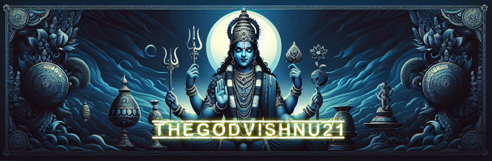

# Ishaan Sandhwar

**B.Tech CSE — AI/ML specialization @ Lovely Professional University · Class of 2028**

Algorithms se pehle library nahi. PSO, Dijkstra, heaps, hash maps — scratch se likhta hoon, phir libraries use karta hoon.

---

## 📌 Featured Projects

### 🚨 LifeLine — Smart City Disaster Response & Evacuation Simulator
Zero-dependency **C++17** backend serving a REST API *and* a built React (Vite) frontend from a single static binary. Fictional city of 40 locations and 83 roads.

- Custom **min-heap, max-heap, djb2 hash map, trie, Union-Find** — written from scratch, no STL containers
- Dijkstra, A\*, Bellman-Ford, Floyd-Warshall, Edmonds-Karp max-flow/min-cut, BFS disaster spread, Tarjan bridges, Prim/Kruskal MST, 0/1 knapsack DP
- **96 checks across 5 test suites**, cross-verified against `networkx` over 1,600+ node pairs
- A\* settles **8 nodes vs Dijkstra's 24** on the same 4.78 km path

`C++17` `React` `Vite` `Leaflet` `REST`
→ **[Code](https://github.com/TheGodVishnu21/lifeline)** · [Live demo](https://github.com/TheGodVishnu21/lifeline#demo)

---

### 💳 PSO Credit Card Fraud Detection
Binary **Particle Swarm Optimization implemented from scratch** (sigmoid transfer function, repair mask, early stopping) for feature selection on a heavily imbalanced fraud dataset — 50,000 rows, 492 fraud cases (0.98% positive rate).

- 30 features → **7 selected**; swarm converged at iteration 18 (30 particles, 50 max iters)
- PSO + Random Forest: **ROC-AUC 0.977 · PR-AUC 0.886 · F1 0.888 · MCC 0.888**
- Logistic-regression baseline on all 30 features: ROC-AUC 0.974 · PR-AUC 0.881 — documented honestly, including where precision *drops*
- SMOTE applied to the training split only, 7 unit tests on the PSO core, Parquet caching for 5–10× faster repeat runs, 4-tab Streamlit dashboard

`Python` `scikit-learn` `imbalanced-learn` `Streamlit` `pytest`
→ **[Code](https://github.com/TheGodVishnu21/PSO_Credit_Card_Fraud_Detection)**

---

### 🛍️ Product Intelligence Engine
LLM + RAG pipeline for automated product catalogue enrichment — messy listings in, structured attributes out.

`Python` `LLM` `RAG` `embeddings`
→ **[Code](https://github.com/TheGodVishnu21/product-intelligence-engine)**

<!-- TODO Ishaan: SUBMISSION.md se 3 real bullets uthaake yahan daal — architecture, dataset size, accuracy/latency number. -->

---

### 🤖 Agentic AI for Academic Benefit Nomination · *in progress*
Five-stage agentic system for my university's academic benefits pipeline: VLM document extraction → deterministic eligibility rule engine → bi-encoder + cross-encoder course mapping with contrastive fine-tuning → calibrated approval prediction → agent orchestration with mandatory human confirmation.

Evaluated on Precision@3 / MRR / NDCG@5 with forward-chaining validation, not random splits. Prompt-injection defences built in at the document-parsing layer. Shipping October 2026.

`Python` `sentence-transformers` `LLM agents` `FastAPI`

---

## 🛠️ Stack

**Comfortable**  

**Currently learning**  

---

## 📜 Certifications

| Credential | Issuer | Date |
|---|---|---|
| Oracle Cloud Infrastructure 2025 Certified **AI Foundations Associate** | Oracle | Nov 2025 |
| Oracle Data Platform 2025 Certified **Foundations Associate** | Oracle | May 2026 |
| DSA Placement Bootcamp — **Grade O (90%+)** | LPU Centre for Professional Enhancement | Jul 2026 |
| AI Mentorship Internship | Launched Global × Deevelo X | May–Jun 2025 |

---

## 🎯 Currently

- 🔬 Shipping the agentic nomination system — prototype Aug, deployment Oct 2026
- 📈 Andrew Ng's ML Specialization → Deep Learning Specialization
- 🧮 **GATE DA** — 2027 practice run, 2028 for real
- ⚔️ DSA in C++, arrays se shuru, har topic cover karna hai
- 💬 Open to AI/ML internships and research collaborations

---

## 📊 GitHub

---

*Off the clock: chess, PC gaming, and dark anime.*

